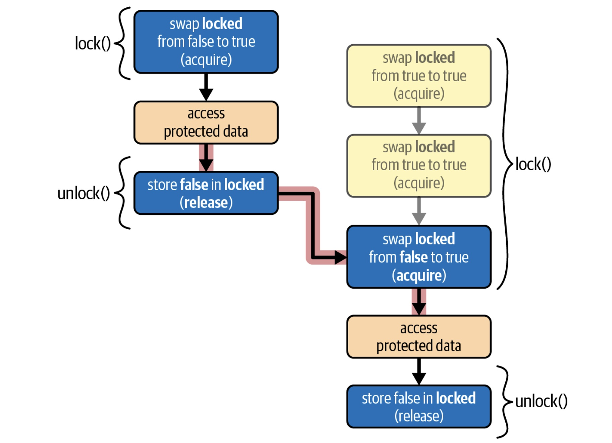

# conutils

conutils is a collection of utilities for concurrent programming in Rust.

## Features

- [x] [mpsc](./src/mpsc.rs): Multi Producer Single Consumer channel.
- [x] [spinlock](./src/spinlock.rs): Spinlock implementation.
- [x] [channel](./src/channel.rs): Channel implementation.
- [x] [arc](./src/arc.rs): Arc implementation.
- [x] [mutex](./src/mutex.rs): Mutex implementation.

## Figures

### SpinLock

